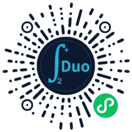
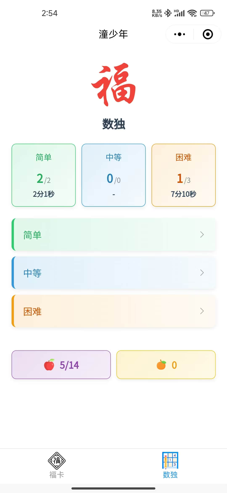
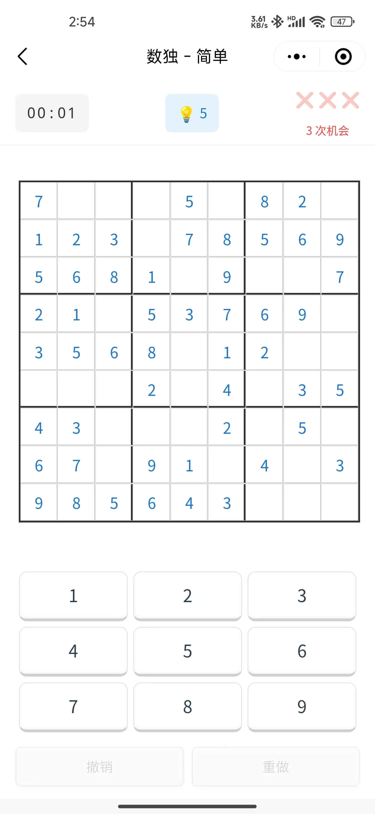
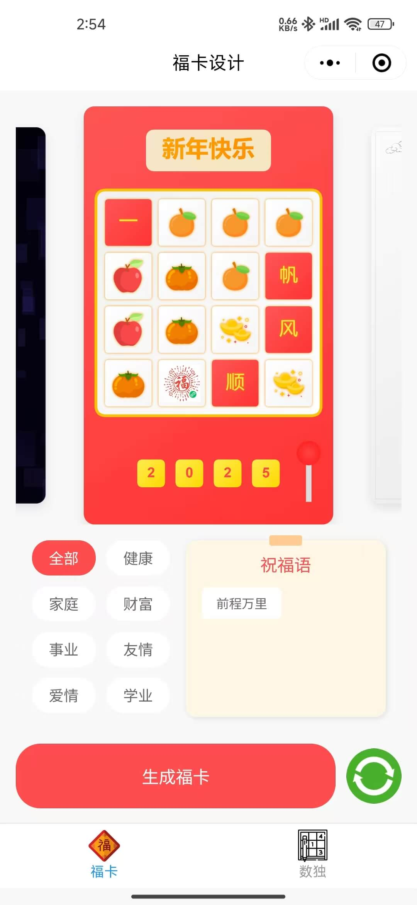
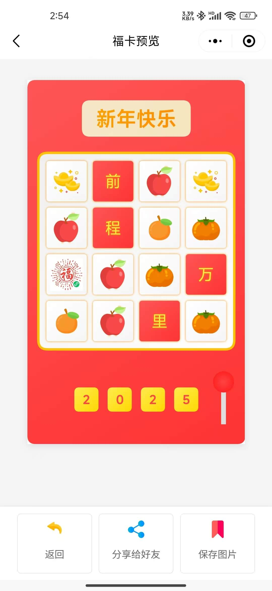
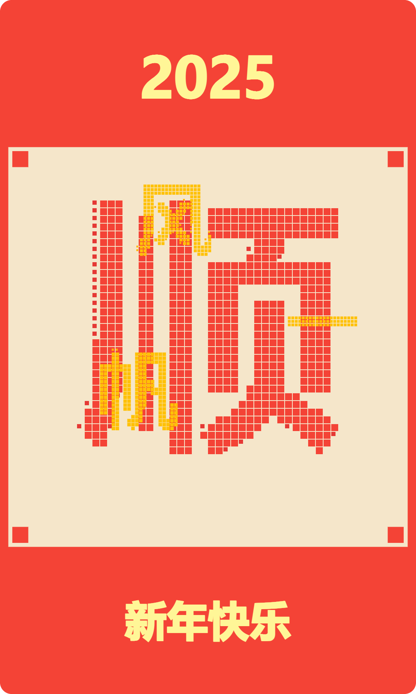
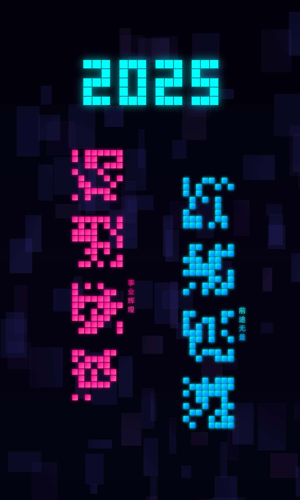
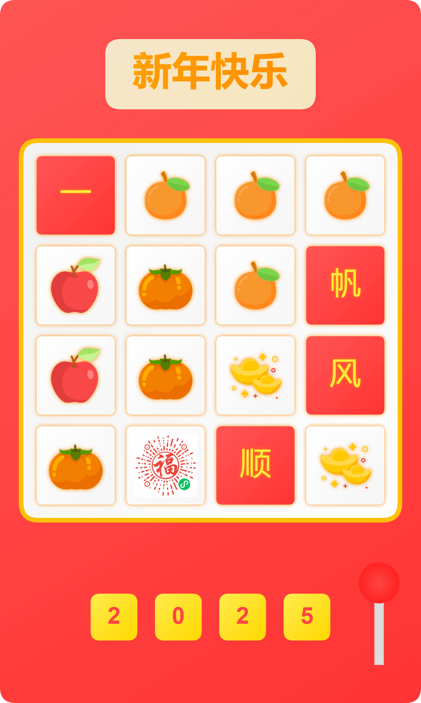

# 二多Lab

<div align="center">

[](https://github.com/erduo10/erDuoLab)
[](https://github.com/erDuo10/erDuoLab/blob/master/LICENSE)
[](https://github.com/erduo10/erDuoLab/stargazers)
[](https://gitee.com/erDuoUp/erDuoLab)

二多Lab是一个集数独游戏与福卡设计于一体的微信小程序，全程使用 Cursor AI 辅助开发。

> 🔥 [查看详细介绍](./INTRODUCTION.md) - 了解本项目的AI辅助开发全过程与最佳实践

[功能介绍](#功能介绍) |
[快速开始](#快速开始) |
[项目结构](#项目结构) |
[技术栈](#技术栈) |
[开发计划](#开发计划) |
[贡献指南](#贡献指南)

</div>

## 功能介绍

- 🎮 **数独游戏**
  - 多难度级别选择
  - 实时计时与计分
  - 游戏存档功能
  - 成就系统
  
- 🎨 **福卡设计**
  - 多种艺术风格：赛博朋克、水墨、像素等
  - 个性化祝福语
  - 一键分享

## 快速开始

### 预览

<div align="center">

#### 扫码体验




#### 数独游戏

<table>
  <tr>
    <td></td>
    <td></td>
    <td></td>
  </tr>
  <tr>
    <td align="center">数独首页</td>
    <td align="center">数独游戏页</td>
    <td align="center">数独成就系统</td>
  </tr>
</table>

#### 福卡设计

<table>
  <tr>
    <td></td>
    <td></td>
  </tr>
  <tr>
    <td align="center">福卡设计首页</td>
    <td align="center">福卡预览</td>
  </tr>
</table>

#### 福卡样式

<table>
  <tr>
    <td></td>
    <td></td>
    <td></td>
    <td></td>
    <td></td>
    <td></td>
  </tr>
  <tr>
    <td align="center">像素</td>
    <td align="center">赛博朋克</td>
    <td align="center">花瓣</td>
    <td align="center">水墨</td>
    <td align="center">红包</td>
    <td align="center">老虎机</td>
  </tr>
</table>

<!-- </details> -->

</div>

### 安装部署

1. 克隆项目
```bash
# GitHub
git clone https://github.com/erduo10/erDuoLab.git
# 或者 Gitee
git clone https://gitee.com/erDuoUp/erDuoLab.git
cd erDuoLab
```

2. 项目配置
- 复制并重命名配置文件：
```bash
cp miniprogram/envList.example.js miniprogram/envList.js
cp miniprogram/duo.example.js miniprogram/duo.js
```
- 配置文件说明：
  - `envList.js`: 配置云环境ID
  - `duo.js`: 配置云环境和存储信息

3. 导入项目
- 打开微信开发者工具
- 导入项目，选择项目目录
- 填入自己的小程序 AppID

## 技术栈

- 📱 微信小程序原生框架
- ☁️ 微信云开发
  - 云函数
  - 云数据库
  - 云存储
- 🤖 Cursor AI 辅助开发
  > 💡 查看 [AI辅助开发实践](./INTRODUCTION.md#ai开发经验) 了解详细开发过程

## 项目结构

```
erDuoLab:
        ├─cloudfunctions 云函数
        │  ├─duoAchievement 成就系统
        │  │
        │  ├─duoCoins 金币系统
        │  │
        │  ├─duoGameState 游戏状态
        │  │
        │  ├─duoGameStatistics 游戏统计
        │  │
        │  ├─duoReward 奖励系统
        │  │
        │  ├─duoUser 用户系统
        │  │
        │  ├─generateFuka 生成福卡
        │  │
        │  ├─getBlessings 获取祝福
        │  │
        │  ├─getFukaDetail 获取福卡详情
        │  │
        │  └─updateUserAdReward 更新用户广告奖励
        │
        ├─cursor 常用总结
        │  ├─000base cursor 常用基础总结
        │  │
        │  ├─000cursor summary cursor 常用总结
        │  │
        │  ├─001数独功能开发
        │  │
        │  ├─002福卡功能开发流程
        │  │
        │  ├─fuka图片
        │  │
        │  └─数独分享页面设计公众号封面设计
        │
        └─miniprogram 小程序
            │
            ├─components 组件
            │  ├─achievement-notification 成就通知
            │  │
            │  ├─fuka-styles 福卡样式
            │  │  ├─cyberpunk 赛博朋克
            │  │  │
            │  │  ├─flower 花瓣
            │  │  │
            │  │  ├─ink 墨水
            │  │  │
            │  │  ├─pixel 像素
            │  │  │
            │  │  ├─red-packet 红包
            │  │  │
            │  │  └─slot 转盘
            │  │
            │  ├─game-complete-modal 游戏完成
            │  │
            │  ├─game-load-save-modal 游戏加载保存
            │  │
            │  ├─game-restart-modal 游戏重启
            │  │
            │  ├─hint-button 提示按钮
            │  │
            │  ├─number-pad 数字键盘
            │  │
            │  ├─sudoku-board 数独棋盘
            │  │
            │  └─timer 计时器
            │
            ├─images 图片资源
            │
            ├─pages 页面
            │  ├─about 关于
            │  │
            │  ├─achievements 数独成就
            │  │
            │  ├─fukaindex 福卡首页
            │  │
            │  ├─game 数独游戏
            │  │
            │  ├─index 数独首页
            │  │
            │  └─preview 福卡预览
            │
            ├─services 服务
            │  │
            │  ├─achievement 成就
            │  │
            │  ├─fuka 福卡
            │  │
            │  ├─game 数独游戏
            │  │
            │  ├─reward 奖励
            │  │
            │  └─user 用户
            │
            ├─store 状态
            │
            ├─tests 测试
            │
            └─utils 工具
                ├─constants 常量
                │
                ├─event 事件驱动系统
                │
                ├─fuka 福卡设计
                │  │
                │  ├─config 配置
                │  │
                │  ├─core 核心
                │  │
                │  └─helpers 辅助
                │
                ├─helpers 辅助
                │
                ├─storage 存储
                │
                └─wxs 小程序自定义组件
```


## 开发计划


暂定 2025年 完成 10个 微信小程序功能，以及 一个 小游戏

- [x] 数独游戏基础功能
- [x] 福卡设计系统
- [ ] 其他 8个 小程序功能
- [ ] 1个小游戏


## 本地开发

### 环境要求

- 微信开发者工具
- Node.js (>= 12.0.0)
- 微信小程序账号
- 云开发环境

### 开发指南

1. **配置开发环境**
   - 申请微信小程序账号
   - 开通云开发
   - 配置云开发环境

2. **本地开发**
   - 本地调试：使用微信开发者工具

3. **部署发布**
   - 云函数部署
   - 云数据库初始化
   - 小程序发布

## 贡献指南

目前项目处于个人开发阶段，暂不接受外部贡献。欢迎通过 Issue 反馈问题或建议。

## 版本历史

查看 [CHANGELOG.md](./CHANGELOG.md) 了解详细版本更新历史。

## 许可证

本项目采用 [MIT 许可证](LICENSE)。

## 问题反馈

如果您在使用过程中遇到任何问题，或有好的建议，欢迎通过以下方式反馈：

1. GitHub提交 [Issue](https://github.com/erduo10/erDuoLab/issues)
2. Gitee提交 [Issue](https://gitee.com/erDuoUp/erDuoLab/issues)
3. 关注公众号「二多Lab」，后台留言
4. bilibili：[主页](https://space.bilibili.com/24818142) 
5. 发送邮件至 duoup4ever@qq.com

## ☕️ 请作者喝咖啡

如果这个项目对您有帮助，可以请作者喝杯咖啡以示支持。您的支持是我持续维护的动力！

> 💡 捐赠资金将用于:
> - 服务器维护费用
> - 项目持续开发
> - 文档完善

<div align="center">
  <table>
    <tr>
      <td align="center">
        
        <br/>
        <sub>微信扫码赞赏</sub>
      </td>
      <td align="center">
        
        <br/>
        <sub>支付宝扫码赞赏</sub>
      </td>
    </tr>
  </table>
</div>

<div align="center">

#### 🙏 感谢所有赞助者的支持！

</div>


## 致谢

感谢 Cursor AI 在开发过程中提供的智能协助。

## 📝 结语

本项目不仅是一个小程序的开源，更是一份完整的AI辅助开发实践指南。希望能为更多开发者在AI时代的开发之路提供参考和帮助。

欢迎Star、Fork，让我们一起在AI助力下，打造更好的应用！