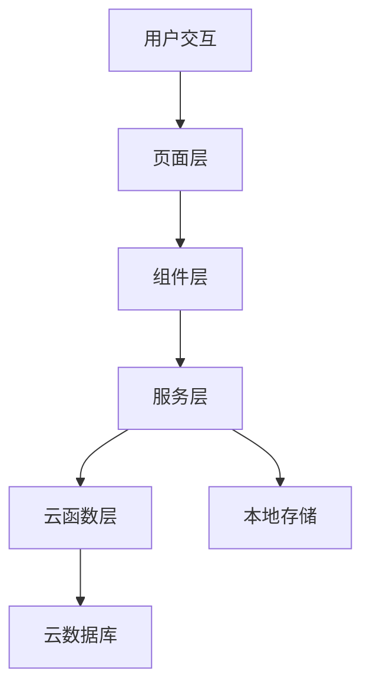

<query_context>
- 项目背景：数独微信小程序
- 当前问题：分析数独小程序的代码结构
- 相关代码：代码结构如下

云函数
cloudfunctions
│  config.json
│
├─duoAchievement
│      config.json
│      index.js
│      package-lock.json
│      package.json
│
├─duoGameState
│      config.json
│      index.js
│      package-lock.json
│      package.json
│
├─duoGameStatistics
│      config.json
│      index.js
│      package-lock.json
│      package.json
│
├─duoReward
│      config.json
│      index.js
│      package.json
│
└─duoUser
        config.json
        index.js
        package.json

代码
miniprogram:
│  app.js
│  app.json
│  app.wxss
│  envList.js
│  uploadCloudFunction.bat
│  uploadError.txt
│
├─components
│  ├─achievement-notification
│  │      index.js
│  │      index.json
│  │      index.wxml
│  │      index.wxss
│  │
│  ├─achievement-panel
│  │      index.js
│  │      index.wxml
│  │      index.wxss
│  │
│  ├─game-complete-modal
│  │      index.js
│  │      index.json
│  │      index.wxml
│  │      index.wxss
│  │
│  ├─game-load-save-modal
│  │      index.js
│  │      index.json
│  │      index.wxml
│  │      index.wxss
│  │
│  ├─game-restart-modal
│  │      index.js
│  │      index.json
│  │      index.wxml
│  │      index.wxss
│  │
│  ├─hint-button
│  │      index.js
│  │      index.json
│  │      index.wxml
│  │      index.wxss
│  │
│  ├─number-pad
│  │      index.js
│  │      index.json
│  │      index.wxml
│  │      index.wxss
│  │
│  ├─reward-panel
│  │      index.js
│  │      index.wxml
│  │      index.wxss
│  │
│  ├─sudoku-board
│  │      index.js
│  │      index.json
│  │      index.wxml
│  │      index.wxss
│  │      utils.wxs
│  │
│  └─timer
│          index.js
│          index.json
│          index.wxml
│          index.wxss
│
├─config
│      app-config.js
│
├─images
│      arrow.svg
│      game-active.png
│      game.png
│      logo.png
│      profile-active.png
│      profile.png
│
├─pages
│  ├─achievements
│  │      achievements-core.js
│  │      achievements-ui.js
│  │      achievements.js
│  │      achievements.json
│  │      achievements.wxml
│  │      achievements.wxss
│  │
│  ├─alerts
│  │      alerts.js
│  │      alerts.wxml
│  │
│  ├─camera
│  │      camera.js
│  │      camera.wxml
│  │
│  ├─game
│  │      game-core.js
│  │      game-interaction.js
│  │      game-storage.js
│  │      game-style.js
│  │      game-ui.js
│  │      game.js
│  │      game.json
│  │      game.wxml
│  │      game.wxss
│  │
│  ├─index
│  │      index.js
│  │      index.wxml
│  │      index.wxss
│  │
│  ├─profile
│  │      profile-core.js
│  │      profile-ui.js
│  │      profile.js
│  │      profile.json
│  │      profile.wxml
│  │      profile.wxss
│  │
│  └─rewards
│          rewards-core.js
│          rewards-ui.js
│          rewards.js
│          rewards.json
│          rewards.wxml
│          rewards.wxss
│
├─services
│  │  error-handler.js
│  │
│  ├─achievement
│  │      achievement-manager.js
│  │      achievement-notification.js
│  │
│  ├─game
│  │      game-state.js
│  │      game.js
│  │      history-manager.js
│  │
│  ├─reward
│  │      reward-config.js
│  │      reward-handler.js
│  │      reward-manager.js
│  │      reward-storage.js
│  │
│  └─user
│          user-auth.js
│          user-manager.js
│          user-storage.js
│
├─tests
│      setup.js
│
└─utils
    ├─constants
    │      error-codes.js
    │      game-constants.js
    │
    ├─event
    │      event-data.js
    │      event-manager.js
    │      event-types.js
    │
    ├─helpers
    │      logger.js
    │
    ├─storage
    │      local-storage.js
    │
    └─wxs
            format.wxs

- 期望结果：
基于以上代码，请分析代码结构，并给出代码功能总结
理解当前代码，分析之后提出的问题

</query_context>

<custom_instructions>
// AI 交互规则

### 一级规则（必须遵循）

1. **解决方案确定性**
- 不确定时必须明确告知
- 多方案时说明优劣
- 标注适用场景和限制
- 评估实现和维护成本

2. **代码分析规范**
- 绘制完整调用链路图
- 分析数据流转过程
- 检查业务逻辑完整性
- 识别代码重复和依赖
- 验证边界条件处理

3. **代码更新规范**
- 提供代码对比
- 说明修改原因
- 完善代码注释
- 评估影响范围
- 确保向后兼容
- 提供回滚方案
- 输出完整代码

4. **反馈机制**
- 及时反馈进展
- 立即通知问题
- 跟踪解决进度
- 记录解决方案

### 二级规则（按需使用）

5. **代码质量控制**
- 符合项目规范
- 控制代码复杂度
- 优化性能和内存
- 处理异步操作

6. **测试规范**
- 单元测试要求
- 集成测试规范
- 自动化测试流程

7. **安全规范**
- 数据安全处理
- 用户输入验证
- 访问控制机制

### 三级规则（参考使用）

8. **最佳实践**
- 模块化设计
- 错误处理机制
- 性能优化建议
- 文档维护规范

9. **交互优化**
- 记录交互要点
- 追踪重复问题
- 维护问题库
- 生成分析报告

### 分析报告模板

1. **调用链路**
- 相关文件列表
- 方法调用关系
- 数据流转图

2. **问题分析**
- 发现的问题
- 优化建议
- 修改示例

3. **实施建议**
- 优先级排序
- 实施步骤
- 风险评估
</custom_instructions>

-------------------------------------------------------------------------------------------
是的,我可以看到这个文件。这是一个数独微信小程序的代码结构分析文档。让我基于文件内容进行详细分析:

### 1. 整体架构分析

项目采用典型的微信小程序架构,分为两大部分:

1. **云函数部分 (cloudfunctions)**
   - duoAchievement: 成就系统
   - duoGameState: 游戏状态管理
   - duoGameStatistics: 游戏统计
   - duoReward: 奖励系统
   - duoUser: 用户管理

2. **小程序端 (miniprogram)**
   - 遵循标准小程序结构(app.js/json/wxss)
   - 采用模块化设计,清晰的职责分离

### 2. 核心模块分析

#### 2.1 前端组件 (components)
- 成就系统相关组件
- 游戏核心组件(数独棋盘、数字键盘等)
- 模态框组件
- 计时器组件

#### 2.2 页面模块 (pages)
每个页面采用分层设计:
- core: 核心业务逻辑
- ui: 界面交互
- storage: 数据存储
- interaction: 用户交互

#### 2.3 服务层 (services)
- achievement: 成就系统
- game: 游戏核心逻辑
- reward: 奖励系统
- user: 用户管理
- error-handler: 错误处理

#### 2.4 工具层 (utils)
- constants: 常量定义
- event: 事件系统
- helpers: 辅助工具
- storage: 存储工具
- wxs: WXS模块

### 3. 数据流转分析

### 4. 发现的问题和优化建议

1. **代码组织问题**
   - 建议增加统一的API层管理云函数调用
   - 考虑添加中间件层处理通用逻辑

2. **可维护性改进**
   - 建议添加统一的类型定义
   - 可以考虑引入TypeScript
   - 需要补充单元测试

3. **性能优化方向**
   - 可以考虑增加数据缓存层
   - 优化组件重渲染逻辑
   - 添加性能监控

4. **安全性建议**
   - 增加请求签名机制
   - 添加数据加密层
   - 完善权限控制

### 5. 实施建议

优先级排序:
1. 添加统一API层 (High)
2. 补充单元测试 (High)
3. 引入TypeScript (Medium)
4. 优化性能 (Medium)
5. 增强安全机制 (Low)

风险评估:
- API层改造可能影响现有业务流程
- TypeScript改造工作量较大
- 需要注意向后兼容性

这个项目整体架构清晰,模块划分合理,但在工程化、测试覆盖、性能优化等方面还有提升空间。建议按照优先级逐步改进,确保系统稳定性。
