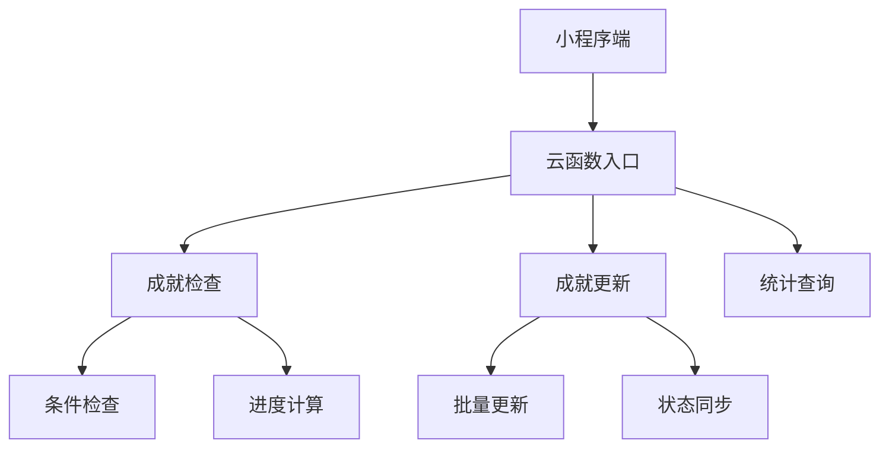
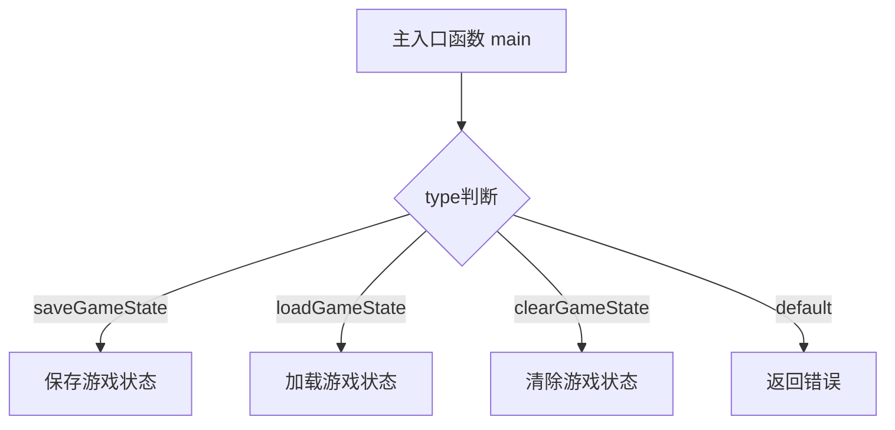

### 云函数

#### duoGameStatistics

好的，让我重新梳理一下优化后的云函数结构和功能：

### 1. 入口函数与路由
```javascript:cloudfunctions/duoGameStatistics/index.js
const ROUTE_HANDLERS = {
  recordGame: handleRecordGame,      // 记录游戏结果
  getStatistics: handleGetStatistics, // 获取统计数据
  getLeaderboard: handleGetLeaderboard, // 获取排行榜
  getRecentGames: handleGetRecentGames  // 获取最近游戏
}
```

### 2. 核心功能函数

1. **记录游戏结果**
```javascript:cloudfunctions/duoGameStatistics/index.js
async function handleRecordGame(OPENID, params) {
  // 1. 验证游戏数据
  validateGameData(params)
  
  // 2. 记录游戏数据到 duo_game_records
  const gameRecord = {
    userId: OPENID,
    score: calculateScore(params),
    ...params,
    createdAt: db.serverDate()
  }
  
  // 3. 更新用户统计数据
  await updateGameStats(OPENID, gameRecord)
}
```

2. **获取统计数据**
```javascript:cloudfunctions/duoGameStatistics/index.js
async function handleGetStatistics(OPENID) {
  // 返回用户统计或初始化数据
  return {
    code: 0,
    data: result.data[0] || { stats: initializeUserStats() }
  }
}
```

3. **获取排行榜**
```javascript:cloudfunctions/duoGameStatistics/index.js
async function handleGetLeaderboard(params) {
  // 按难度和最佳时间排序
  return {
    code: 0,
    data: await db.collection('duo_user_statistics')
      .where({
        [`stats.difficultyStats.${difficulty}.completed`]: db.command.gt(0)
      })
      .orderBy(`stats.difficultyStats.${difficulty}.bestTime`, 'asc')
      .limit(limit)
      .get()
  }
}
```

4. **获取最近游戏记录**
```javascript:cloudfunctions/duoGameStatistics/index.js
async function handleGetRecentGames(OPENID, params) {
  // 按创建时间倒序返回指定数量的游戏记录
  return {
    code: 0,
    data: await db.collection('duo_game_records')
      .where({
        userId: OPENID,
        difficulty: params.difficulty
      })
      .orderBy('createdAt', 'desc')
      .limit(params.limit || 10)
      .get()
  }
}
```

### 3. 辅助函数

1. **计算得分**
```javascript:cloudfunctions/duoGameStatistics/index.js
function calculateScore(gameData) {
  if (!gameData.completed) return 0
  
  const baseScore = {
    'easy': 100,
    'medium': 200,
    'hard': 300
  }[gameData.difficulty]
  
  return Math.max(0, baseScore 
    - (Math.floor(gameData.timeSpent / 60) * 5)  // 时间惩罚
    - (gameData.errors * 10)                      // 错误惩罚
    - (gameData.hintsUsed * 15)                  // 提示惩罚
  )
}
```

2. **更新游戏统计**
```javascript:cloudfunctions/duoGameStatistics/index.js
async function updateGameStats(userId, gameData) {
  // 更新内容包括：
  // - 总游戏数
  // - 完成游戏数
  // - 难度级别统计
  // - 完美游戏统计
  // - 连续记录
  // - 最佳时间
  // - 最后游戏日期
}
```

### 4. 数据结构

1. **默认统计结构**
```javascript:cloudfunctions/duoGameStatistics/index.js
const DEFAULT_STATS = {
  stats: {
    gamesTotal: 0,
    gamesCompleted: 0,
    difficultyStats: {
      easy: { total: 0, completed: 0, perfectGames: 0, bestTime: null },
      medium: { total: 0, completed: 0, perfectGames: 0, bestTime: null },
      hard: { total: 0, completed: 0, perfectGames: 0, bestTime: null }
    },
    streaks: {
      current: { daily: 0, perfect: 0 },
      best: { daily: 0, perfect: 0 }
    },
    lastPlayDate: null
  }
}
```

### 5. 数据验证

```javascript:cloudfunctions/duoGameStatistics/index.js
function validateGameData(data) {
  const schema = {
    difficulty: (val) => ['easy', 'medium', 'hard'].includes(val),
    timeSpent: (val) => typeof val === 'number' && val >= 0,
    hintsUsed: (val) => typeof val === 'number' && val >= 0,
    errors: (val) => typeof val === 'number' && val >= 0,
    completed: (val) => typeof val === 'boolean'
  }
  // 验证所有字段
}
```

所有功能都遵循了统一的数据结构，包含了完整的错误处理和数据验证机制。每个函数都有明确的职责和返回值格式。


#### duoAchievement


好的，让我梳理一下优化后的 `duoAchievement` 云函数的结构和功能：

### 1. 主要功能模块

```javascript:cloudfunctions/duoAchievement/index.js
// 路由处理
const handlers = {
    getAchievements,        // 获取用户成就列表
    checkAchievements,      // 检查成就进度
    getAchievementStats,    // 获取成就统计信息
    getRecentUnlocks,       // 获取最近解锁成就
    getCategoryStats,       // 获取分类统计
    getAchievementConfigs   // 获取成就配置
}
```

### 2. 成就条件检查系统

```javascript:cloudfunctions/duoAchievement/index.js
const achievementConditions = {
    GAME_COMPLETION: (data, config) => ({...}),  // 游戏完成次数
    DIFFICULTY: (data, config) => ({...}),       // 难度相关成就
    PERFECT_GAME: (data, config) => ({...}),     // 完美游戏成就
    SPEED: (data, config) => ({...}),            // 速度相关成就
    STREAK: (data, config) => ({...})            // 连续完成成就
}
```

### 3. 核心数据结构

```typescript
// 1. 成就配置
interface AchievementConfig {
    id: string;
    type: string;
    category: {
        id: string;
        name: string;
    };
    status: 'ACTIVE';
    order: number;
    targetValue: number;
    points: number;
    name: string;
    description: string;
    icon: string;
}

// 2. 用户成就记录
interface UserAchievement {
    userId: string;
    achievementId: string;
    unlocked: boolean;
    progress: {
        currentValue: number;
        targetValue: number;
        percentage: number;
    };
    unlockTime: Date | null;
    createdAt: Date;
    updatedAt: Date;
}

// 3. 统一返回格式
interface CloudResponse<T> {
    code: number;
    data: T;
    msg?: string;
}
```

### 4. 优化后的主要方法

1. **检查成就进度**
```javascript:cloudfunctions/duoAchievement/index.js
async function checkAchievements(userId, gameData) {
    // 并行获取数据
    const [userStats, configs] = await Promise.all([
        db.collection('duo_user_statistics').where({ userId }).get(),
        db.collection('duo_achievement_configs').where({ status: 'ACTIVE' }).get()
    ]);
    
    // 检查成就进度并返回更新
    return {
        code: 0,
        data: { completedAchievements, progressUpdates }
    };
}
```

2. **批量更新成就进度**
```javascript:cloudfunctions/duoAchievement/index.js
async function updateAchievementProgress(userId, progressUpdates) {
    // 批量获取现有记录
    const existingAchievements = await db.collection('duo_user_achievements')
        .where({
            userId,
            achievementId: _.in(progressUpdates.map(u => u.achievementId))
        })
        .get();

    // 分离新增和更新操作
    const { adds, updates } = separateOperations(existingAchievements, progressUpdates);
    
    // 批量执行操作
    return await executeOperations(adds, updates);
}
```

### 5. 数据库集合

```javascript
// 1. 成就配置集合
'duo_achievement_configs': {
    id: string,          // 成就ID
    type: string,        // 成就类型
    status: string,      // 状态
    category: object,    // 分类信息
    targetValue: number, // 目标值
    // ... 其他配置字段
}

// 2. 用户成就集合
'duo_user_achievements': {
    userId: string,      // 用户ID
    achievementId: string, // 成就ID
    unlocked: boolean,   // 解锁状态
    progress: object,    // 进度信息
    // ... 其他字段
}

// 3. 用户统计集合
'duo_user_statistics': {
    userId: string,      // 用户ID
    stats: object,       // 统计数据
    // ... 其他统计字段
}
```

### 6. 性能优化特性

1. **并行数据获取**
   - 使用 Promise.all 并行获取数据
   - 减少数据库查询等待时间

2. **批量操作优化**
   - 一次性获取现有记录
   - 批量执行新增和更新操作
   - 考虑数据库限制（20条）

3. **数据缓存**
   - 配置数据缓存
   - 减少重复查询

4. **错误处理**
   - 统一的错误处理机制
   - 详细的错误日志

### 7. 调用关系



这个优化后的云函数结构清晰，功能完整，性能良好。主要特点是：
1. 模块化设计
2. 批量处理优化
3. 统一的数据结构
4. 完善的错误处理
5. 良好的扩展性

如果您需要了解某个具体部分的详细实现，我可以进一步展开说明。


#### duoGameState

是的，我可以看到这个云函数文件 `cloudfunctions/duoGameState/index.js`。这是一个微信小程序的云函数，主要实现了游戏状态的保存、加载和清除功能。让我为您分析一下这个文件的主要功能：

### 调用链路分析



### 功能说明

1. **主要功能**
   - 保存游戏状态 (saveGameState)
   - 加载游戏状态 (loadGameState)
   - 清除游戏状态 (clearGameState)

2. **数据库操作**
   - 使用 `duo_game_saves` 集合
   - 包含用户ID、难度、游戏状态、更新时间和过期时间

3. **安全特性**
   - 使用 OPENID 确保用户数据隔离
   - 包含数据过期机制（24小时）

### 代码质量分析

**优点：**
- 结构清晰，功能模块化
- 包含错误处理机制
- 使用 async/await 处理异步操作
- 有数据过期机制

**可能的优化点：**
1. 可以添加输入参数验证
2. 可以统一错误处理机制
3. 可以添加日志记录
4. 可以优化数据库查询性能


#### duoUser

是的，我可以看到这个云函数文件 `duoUser/index.js`。这是一个微信小程序的云函数，主要实现了用户管理相关的功能，包括：

1. **登录功能** (`login`)
   - 检查用户是否存在
   - 新用户自动注册
   - 更新登录信息

2. **更新用户数据** (`updateUserData`)
   - 支持更新用户信息(userInfo)
   - 支持更新设置(settings)
   - 支持更新会话数据(session)

3. **获取用户数据** (`getUserData`)
   - 支持按字段筛选获取
   - 返回指定用户的数据

4. **主函数** (`main`)
   - 统一的函数入口
   - 根据 type 参数路由到不同的处理函数

