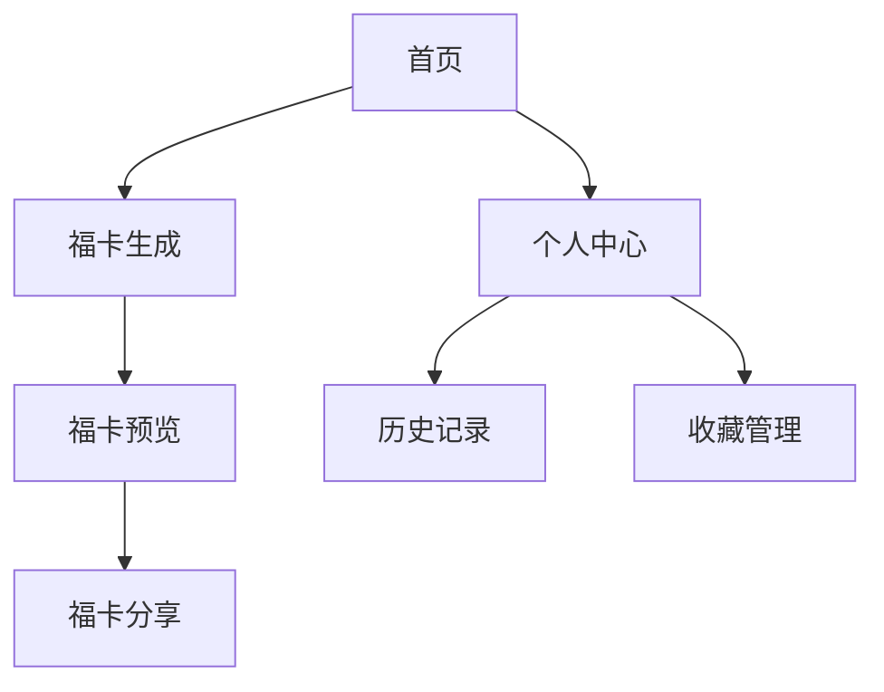

以下是完整的福卡小程序需求设计方案。

# 福卡小程序需求设计文档

## 一、功能概述

### 1. 核心功能模块


## 二、详细功能设计

### 1. 首页模块

#### 1.1 福卡样式选择
- **样式类型**
  - 像素风格
  - 老虎机风格
  - 圆盘风格
- **预览功能**
  - 支持实时预览
  - 提供样式说明
  - 展示示例效果

#### 1.2 福卡类型选择
- **类别分类**
  ```markdown
  - 学业祝福
  - 事业祝福
  - 家庭祝福
  - 爱情祝福
  - 健康祝福
  - 财运祝福
  ```

### 2. 福卡生成模块

#### 2.1 生成规则
```typescript
interface GenerationRules {
    // 核心祝福语规则
    mainBlessing: {
        length: 4;  // 四字祝福
        highlight: 1;  // 突出显示一个字
    };
    // 相关祝福语
    relatedBlessings: {
        minCount: 3;
        maxCount: 6;
        displayMode: 'random';
    };
    // 生成概率
    probability: {
        rare: 0.1;    // 稀有福卡
        normal: 0.6;   // 普通福卡
        common: 0.3;   // 基础福卡
    };
}
```

#### 2.2 样式设计规范

##### 2.2.1 像素风格
```markdown
- 布局：
  - 核心区域：中央 400x400px
  - 方块尺寸：基础 20x20px，突出 40x40px
- 动画：
  - 像素聚合效果：300ms
  - 核心文字放大效果：200ms
```

##### 2.2.2 老虎机风格
```markdown
- 布局：
  - 显示区域：320x480px
  - 文字大小：常规 36px，突出 48px
- 动画：
  - 滚动时长：1200ms
  - 减速曲线：cubic-bezier(0.4, 0, 0.2, 1)
```

##### 2.2.3 圆盘风格
```markdown
- 布局：
  - 圆盘直径：400px
  - 核心文字：居中，48px
  - 环绕文字：32px
- 动画：
  - 旋转时长：800ms
  - 渐显效果：300ms
```

#### 2.3 配色方案
```css
:root {
    /* 主色调 */
    --primary-red: #FF4D4F;
    --primary-gold: #FAAD14;
    
    /* 辅助色 */
    --secondary-red: #FF7875;
    --secondary-gold: #FFE58F;
    
    /* 背景色 */
    --bg-festive: #FFF1F0;
    --bg-light: #FFFBE6;
}
```

### 3. 云开发架构

#### 3.1 数据库设计
```typescript
// 福卡模板
interface BlessingTemplate {
    id: string;
    category: string;
    mainBlessing: string;
    relatedBlessings: string[];
    rarity: 'rare' | 'normal' | 'common';
    createTime: Date;
}

// 用户福卡记录
interface UserCard {
    id: string;
    userId: string;
    templateId: string;
    style: 'pixel' | 'slot' | 'circle';
    createTime: Date;
    shareCount: number;
    isCollected: boolean;
}
```

#### 3.2 云函数设计
```typescript
interface CloudFunctions {
    // 福卡生成
    generateCard: (params: {
        style: string;
        category: string;
    }) => Promise<BlessingCard>;
    
    // 分享统计
    recordShare: (cardId: string) => Promise<void>;
    
    // 收藏管理
    toggleCollect: (cardId: string) => Promise<boolean>;
}
```

### 4. 用户功能限制

```typescript
interface UserLimits {
    // 生成限制
    generation: {
        dailyLimit: 10;
        cooldown: 60; // seconds
    };
    // 存储限制
    storage: {
        maxHistory: 100;
        maxCollections: 50;
    };
}
```

## 三、性能优化方案

### 1. 资源加载优化
```markdown
- 预加载常用资源
- 图片资源压缩
- 组件按需加载
- 数据本地缓存
```

### 2. 动画性能优化
```markdown
- 使用 CSS3 动画
- 避免大量 DOM 操作
- 优化重绘和回流
- 分层渲染处理
```

## 四、安全措施

### 1. 数据安全
```markdown
- 数据加密传输
- 敏感信息脱敏
- 定期数据备份
- 访问权限控制
```

### 2. 内容安全
```markdown
- 敏感词过滤
- 用户内容审核
- 操作频率限制
- 异常行为监控
```

## 五、测试计划

### 1. 测试范围
```markdown
- 功能测试
- 性能测试
- 兼容性测试
- 安全性测试
```

### 2. 测试指标
```markdown
- 页面加载时间 < 2s
- 动画流畅度 > 30fps
- 云函数响应 < 1s
- 内存占用 < 50MB
```

## 六、发布策略

### 1. 灰度发布计划
```markdown
1. 内部测试版（10%用户）
2. 公测版（30%用户）
3. 全量发布
```

### 2. 监控指标
```markdown
- 用户活跃度
- 功能使用率
- 错误发生率
- 性能指标
```

需要特别关注的是否还有其他具体场景需要补充？或者某个模块需要更详细的设计？
