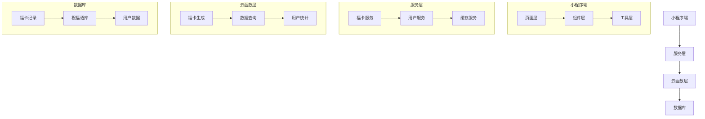
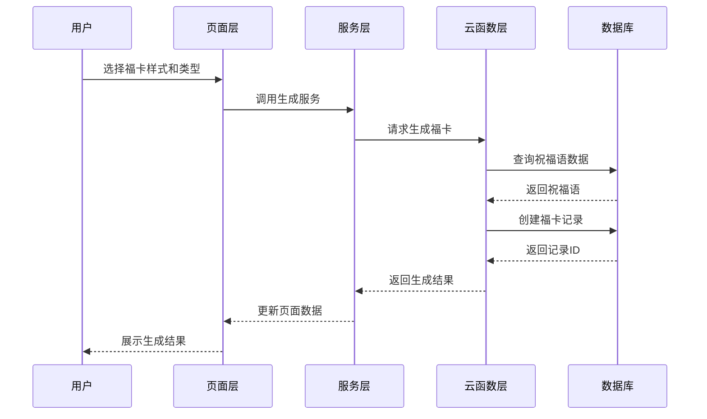

让我从项目整体架构开始，分批输出完整的逻辑设计。

# 福卡小程序逻辑设计（一）：整体架构

## 一、项目架构图



## 二、项目结构设计

```
miniprogram/
├── components/          # 组件目录
│   ├── fuka-styles/    # 福卡样式组件
│   │   ├── pixel/      # 像素风格
│   │   │   ├── index.js
│   │   │   ├── index.wxml
│   │   │   └── index.wxss
│   │   ├── slot/       # 老虎机风格
│   │   └── circle/     # 圆盘风格
│   ├── fuka-preview/   # 福卡预览组件
│   └── share-modal/    # 分享弹窗组件
├── pages/              # 页面目录
│   ├── fuka/          # 福卡首页
│   │   ├── index.js
│   │   ├── index.wxml
│   │   └── index.wxss
│   ├── generate/      # 生成页
│   ├── preview/       # 预览页
│   └── profile/       # 个人中心
├── services/          # 服务层
│   └── fuka/         
│       ├── blessing.js # 祝福语服务
│       ├── card.js     # 福卡服务
│       └── user.js     # 用户服务
├── utils/            # 工具函数
│   ├── constants.js  # 常量定义
│   ├── helper.js     # 辅助函数
│   └── cache.js      # 缓存管理
└── app.js           # 应用入口

cloudfunctions/        # 云函数目录
├── generateFuka/     # 福卡生成
├── getBlessingCombination/ # 获取祝福语组合
├── getFukaDetail/    # 获取福卡详情
└── updateUserStats/  # 更新用户统计
```

## 三、核心模块职责

### 1. 页面层职责
```javascript
{
    "fuka": {
        "职责": "福卡生成入口",
        "功能": [
            "样式选择",
            "类型选择",
            "生成控制"
        ]
    },
    "generate": {
        "职责": "福卡生成过程",
        "功能": [
            "动画展示",
            "生成结果"
        ]
    },
    "preview": {
        "职责": "福卡预览",
        "功能": [
            "福卡展示",
            "分享功能",
            "收藏功能"
        ]
    },
    "profile": {
        "职责": "个人中心",
        "功能": [
            "历史记录",
            "收藏管理",
            "用户统计"
        ]
    }
}
```

### 2. 组件层职责
```javascript
{
    "fuka-styles": {
        "职责": "福卡样式渲染",
        "子组件": {
            "pixel": "像素风格实现",
            "slot": "老虎机风格实现",
            "circle": "圆盘风格实现"
        }
    },
    "fuka-preview": {
        "职责": "福卡预览展示",
        "功能": [
            "样式渲染",
            "交互处理"
        ]
    },
    "share-modal": {
        "职责": "分享功能",
        "功能": [
            "分享选项",
            "分享逻辑"
        ]
    }
}
```

### 3. 服务层职责
```javascript
{
    "blessing": {
        "职责": "祝福语管理",
        "功能": [
            "获取祝福语组合",
            "祝福语缓存"
        ]
    },
    "card": {
        "职责": "福卡管理",
        "功能": [
            "福卡生成",
            "福卡查询",
            "福卡分享"
        ]
    },
    "user": {
        "职责": "用户管理",
        "功能": [
            "用户数据",
            "统计更新",
            "权限控制"
        ]
    }
}
```

### 4. 云函数职责
```javascript
{
    "generateFuka": {
        "职责": "福卡生成",
        "功能": [
            "数据组合",
            "记录创建",
            "用户统计"
        ]
    },
    "getBlessingCombination": {
        "职责": "祝福语获取",
        "功能": [
            "随机选择",
            "数据组合"
        ]
    },
    "getFukaDetail": {
        "职责": "福卡详情",
        "功能": [
            "数据查询",
            "关联处理"
        ]
    },
    "updateUserStats": {
        "职责": "用户统计",
        "功能": [
            "数据更新",
            "限制控制"
        ]
    }
}
```

## 四、数据流转图



这是第一部分的整体架构设计，接下来我将详细说明每个模块的具体实现。需要我先详细说明哪个部分？
