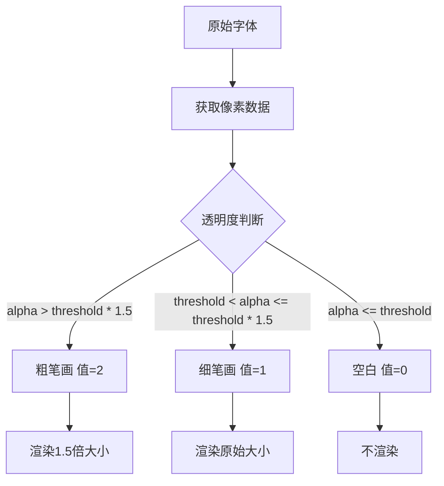

让我详细分析这两段代码的作用及其在图片中的体现。

### 1. 像素点粗细处理机制

```javascript
// 在getCharPixels中的判断
if (alpha > threshold) {
    // threshold * this.config.threshold.thick (128 * 1.5 = 192)
    row.push(alpha > threshold * this.config.threshold.thick ? 2 : 1);
} else {
    row.push(0);
}

// 在renderPixelChar中的应用
const pixelSize = pixel === 2 ? size * 1.5 : size;
```

这是一个两阶段的像素粗细处理机制：

1. **第一阶段（采样）**：
   - `alpha > threshold`：判断是否为字体笔画
   - `alpha > threshold * thick`：判断是否为字体主笔画
   - 输出值：
     - 0：空白区域
     - 1：细笔画区域
     - 2：粗笔画区域

2. **第二阶段（渲染）**：
   - `pixel === 2`：主笔画像素点放大1.5倍
   - `pixel === 1`：普通笔画保持原始大小

### 2. 在图片中的体现

观察"福"字的像素化效果：

```
主笔画（粗）：
- 竖折（丿）
- 横折（一）
这些部分使用了放大1.5倍的像素点

次笔画（细）：
- 点（丶）
- 连接线
这些部分使用了原始大小的像素点
```

### 3. 具体效果分析



### 4. 配置参数影响

```javascript
const CANVAS_BASE = {
    pixelization: {
        threshold: {
            base: 128,     // 基础阈值
            thick: 1.5     // 粗笔画倍数
        }
    }
}
```

这些参数决定了：
1. 基础阈值(128)：区分笔画和背景
2. 粗笔画倍数(1.5)：控制主次笔画的区分度

### 5. 在当前图片中的验证

从图片中可以清晰看到：
1. "福"字的主要笔画（如竖折）明显比其他部分粗
2. 像素点大小有两种层次，形成了笔画的层次感
3. 整体效果形成了清晰的书法风格像素化效果

这种处理方式让像素化的汉字保留了书法的笔画特征，使得字体更有立体感和层次感。
